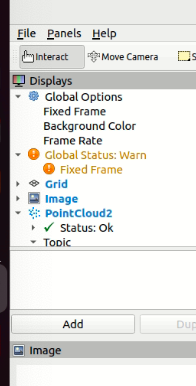

# bridge-camera-setup

## Issue: (Twizy) Using all cameras via PX 2

Link to Issue: https://github.com/orgs/Monash-Connected-Autonomous-Vehicle/projects/8/views/15?pane=issue&itemId=71519558

## Usage

to run: 

`./bridge_setup.sh` on twizy terminal

which will:
1. open up a docker image and run roscore
2. set up the bridge
3. ssh into px2 and start cameras

to test:

`rviz2` on twizy terminal, click on add > list by topics > click on a camera > image

